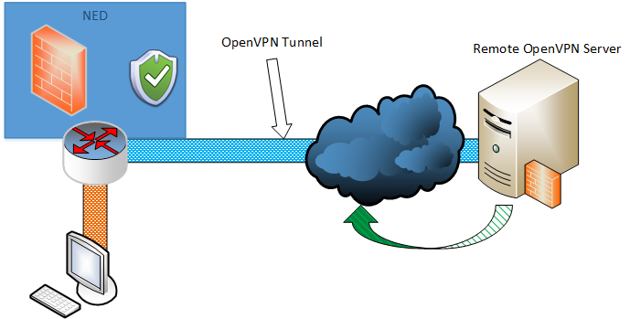
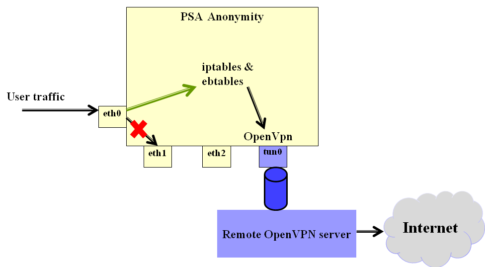

Anonymity PSA
===================
# 1. End-user 

## 1.1 Description / general readme
This PSA aims to provide the user with increased anonymity, privacy and security. Therefore, the Anonymity PSA enables a user to chose among a selection of countries to which he will appear he connects to the internet from.
This way the user can hide his true identity by using a different IP address and all of his traffic is hidden from his ISP and forwarded to the Internet via a remote location through a secured OpenVPN tunnel. Moreover, all 
the user's traffic is encrypted using OpenSSL libraries when sent throught the tunnel which provides him with privacy and security since it cannot be monitored by third-parties.

The general concept of this PSA's concept and how it operates in the perspective of the end user can be seen in the figure below:

	

## 1.2 Features / Capabilities
In order for the user to have increased anonymity the PSA allows the user to mask his true identity by appearing to connect to the Internet from another location. This way the user can mask
personal information including his IP, location and Internet Service provider. The selection of locations supported by the Anonymity PSA are:
* Cyprus
* Germany
* France
* USA
* UK
* Romania
* Singapore
* Indonesia

The user can thus forge his identity by appearing to connect to the Internet from one of the above countries.

## 1.3 Security policy examples
The following examples list *all the possibly policies* that can be enabled from the SECURED GGUI.

```"I, enable, anonymity [country, usa]  "```
- This policy enables PSA Anonymity and the user selects a country from a list. In the example above the country selected is USA and this is the country from which the userr will appear to connect to the inetrnet from.   

## 1.4 Support, troubleshooting / known issues
No known issues.

# 2. Developer / admin

## 2.1 Description / general readme
### General Idea
The PSA-Anonymity aims to provide anonymity and privacy protection to the user. In order to provide anonymity and privacy protection the PSA employs 
OpenVPN to establish secure VPN tunnels to free remote servers in a variety of countries. The advantage is manifold by using this solution. 
The PSA protects anonymity and privacy by masking the user’s real IP and location. When the user connects to the Internet his true IP, location, 
Internet Service Provider along with other information that can be used to identify him can be easily identified. Using the PSA-Anonymity the user 
has the selection of a variety of countries from which he can appear to be connected to the Internet from. This way the user can forge his true identity 
and hide information that can be used to identify him. Moreover, the PSA provides the user with increased security and privacy protection by encrypting 
his internet traffic using OpenVPN. OpenVPN is an open source technology and provides security to the end user by employing OpenSSL’s SSL/TLS protocols to 
provide encryption for his data. All the remote OpenVPN servers supported by this PSA run over TCP port 443 which renders traffic undistinguishable from 
traffic that uses standard HTTPS over SSL thus making it very hard to intercept. In addition, some of the remote OpenVPN servers use either the AES or Blowfish 
cryptographic algorithms of the OpenSSL library which are considered secured. This way, the data that traverse over the ISP’s network and the Internet all the 
way to the remote OpenVPN server are encrypted and thus protected against snooping. This way the user data cannot be monitored by the ISP. In order for the 
PSA to connect to the remote OpenVPN servers all servers require pre-shared secret keys certificates and also authentication using username and password which 
are given inside the servers’ configuration files.

These certificates and authentication credentials are regularly updated and thus the configurations used by the PSA to allow the user to connect to a 
selected server also need to be updated. This task is the responsibility of the PSA developer. To address this, the PSA’s M2L Plugin retrieves the correct 
and up-to-date OpenVPN server configuration file from the PSA’s PSAR account. To ensure that the configuration are always up-to-date the developer uses an 
API provided by the PSAR for such occasions to upload, delete and view configuration files. Therefore, the developer regularly maintains his PSA’s 
configurations files to ensure its smooth operation.

### PSA Internals
The Anonymity PSA uses OpenVPN to estiblish VPN tunnels to remote OpenVPN based on the user's selection. The basic idea of the PSA's operation is illustrated 
in the image below:

	

The PSA uses iptables and ebtables to properly nagivagte the user traffic therough the OpenVPN tunnel instead of directly via eth1.

The OpenVPN tunnel is initiated using the remote OpenVPN server configuartions. A list of valid free OpenVPN server configurations is maintened 
by the PSA developer in the PSA project inside the PSAR in order to have the latest version of the configurations. This is due to the fact that free remote OpenVPN 
servers tend to regularly change their configuration and authentication credentials. Thus, the OpenVPN server configurations must be kept also up-to-date in order 
for the PSA to properly establish the OpenVPN tunnel. The configurations are uploaded by the developer in base64 format as part of the PSA Anonymity project using the provided 
[PSAR API](https://github.com/SECURED-FP7/secured-psar/blob/master/tests/PSARtest.py).

The correct PSA configuartion is fetched from the PSAR by the M2LPlugin at run time based on the user's country selection. The configuration is decoded from base64 \
and returned by the plugin.

## 2.2 Support, troubleshooting / known issues

### Status (OK/No/Partial) -*Partial*-

### Partners involved

* Application: PTL
* MSPL: POLITO,PTL
* M2L Plugin: PTL

### Components and Requirements
VM technology allows creating a full system for the PSA. The components used in this PSA are:
* Operative System: Debian 7 "wheezy"
* iptables 
* ebtables
* OpenVPN

### Manifest

The PSA manifest is available at [Manifest](NED Files/PSAManifest/anonymity). 

This file is currently used by the NED to start the PSA.

### HSPL

The following examples list *all the possibly policies* that can be enabled from the SECURED GGUI.

```"I, enable, anonymity [country, usa]  "```
- This policy enables PSA Anonymity and the user selects a country from a list. In the example above the country selected is USA and this is the country from which the userr will appear to connect to the inetrnet from.   


### MSPL

Example MSPL file for this PSA can be found below:

[anonymity.xml](MSPL/anonymity_mspl.xml): The MSPL contains the user selection of country from which he will appear to connect to the Internet. 

Using the above MSPL the PSA's M2L plugin can extract the country selection and use it to retrieve from the PSA's PSAR project the correct configuration for the remote OpenVPN
server at that country. This configuration will then be passed on to the NED to be uploaded to the PSA upon user login which in its turn will use it to instantiate the OpenVPN tunnel.


### M2L Plug-in

The M2l plug-in is available at [M2LPlugin](M2L/M2LPlugin.java)

The M2L plugin parses the MSPL to get the country:

```java

return ((AnonimityAction) ((RuleSetConfiguration) itResource.getConfiguration()).getConfigurationRule()
					.get(0).getConfigurationRuleAction()).getCountry().get(0);
					
```

and after it gets the country selected by the user it retrives from PSAR the correct configuration file for the remote OpenVPN server at that country:
```java
            /*
			 * Preparing the URI to request the configuartion file from PSAR:
			 * 1.PSAR IP: 195.235.93.146:8080
			 * 2.We know beforehand the PSA is Anonymity: /v1/PSA/dyn_conf/Anonymity
			 * 3.The location parameter is the one used to distinguish between OpenVPN Servers. Namely, location is country and vice versa.
			 */
			uri = new URIBuilder().setScheme("http").setHost("195.235.93.146:8080")
					.setPath("/v1/PSA/dyn_conf/Anonymity").setParameter("location", country).build();
			
			/*
			 * Issuing a GET request to retrieve the correct OpenVPN server configuration.
			 * The response is a json object and the parameter of interest is: dyn_conf which contains the base64 encoded confi file
			 * of the OpenVPN server.
			 */
			HttpGet httpget = new HttpGet(uri);
			CloseableHttpResponse response = httpclient.execute(httpget);
			String json_response = EntityUtils.toString(response.getEntity());
			
			/*
			 * Parsing the json response from PSAR to get the dynamic
			 * configuration
			 */
			JSONObject obj = new JSONObject(json_response);
			String conf = obj.getString("dyn_conf");
```

### License

Please refer to project LICENSE file.

This software incorporates OpenVPN with its own license:
* OpenVPN [license](https://openvpn.net/index.php/license.html)

### TODO
* Integration testing in partner test-beds.

### Testing Methodology
In order to test the PSA using local accounts follow this [guide](tests).


### PSA VM Image
 - PSA Anonymity: https://vm-images.secured-fp7.eu/images/priv/PSA-anonymity.img
 - Credentials: user = root, passwd = no password required

## 2.3 Features / Capabilities
The list of capabilities are (extracted from manifest):
* traffic_anonymizer

## 2.4 Software Improvement Ideas
This PSA could be enhanced with support of more OpenVPN servers to offer more locations from which the user can choose to appear to access the Inernet from.


